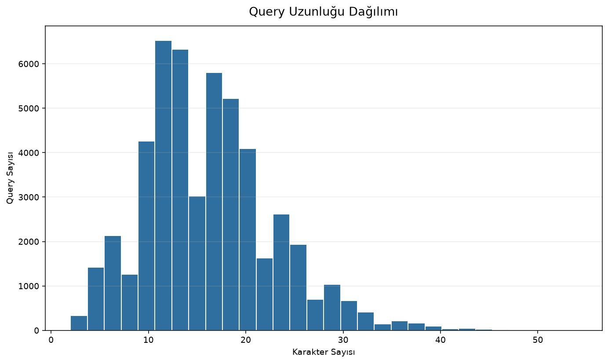
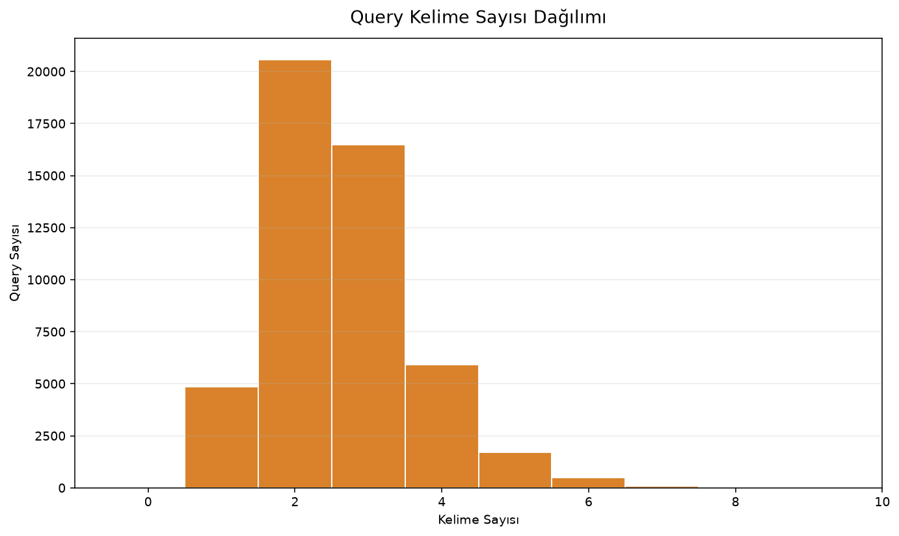
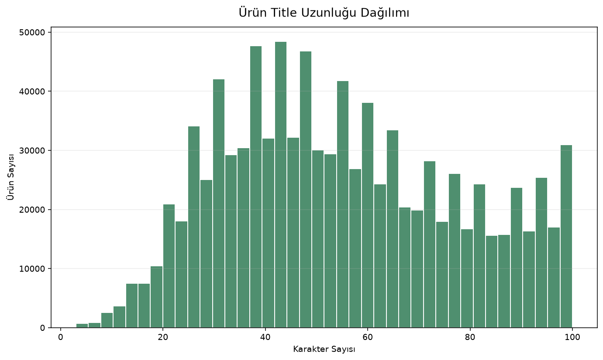
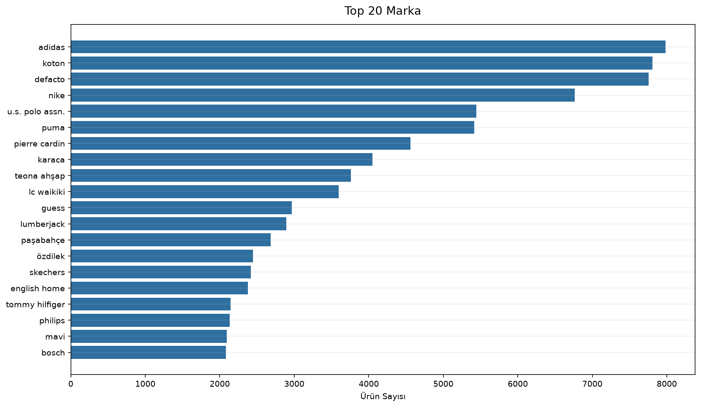
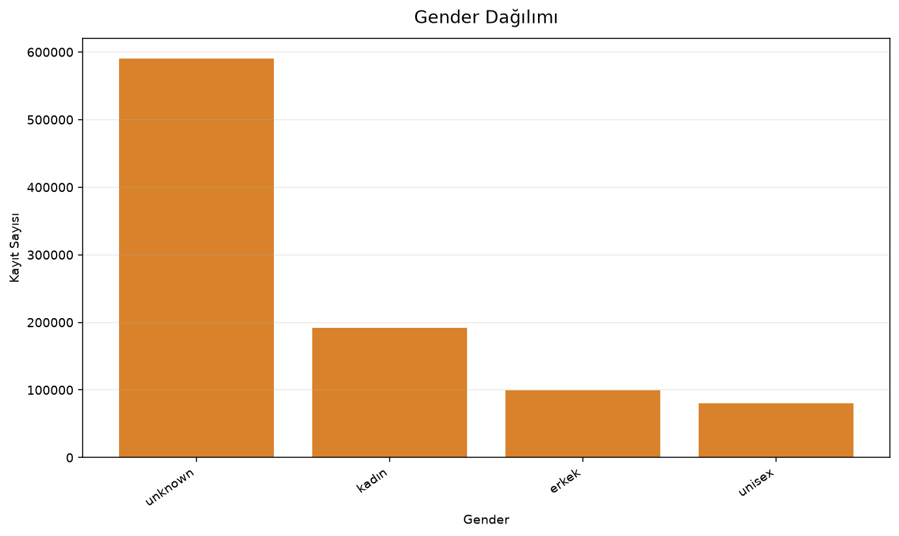
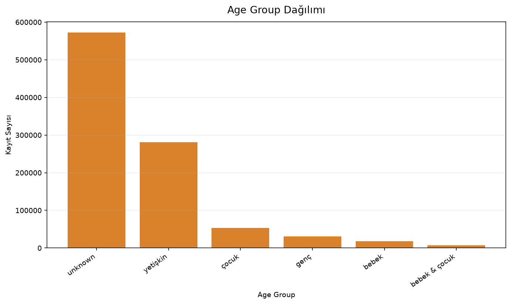
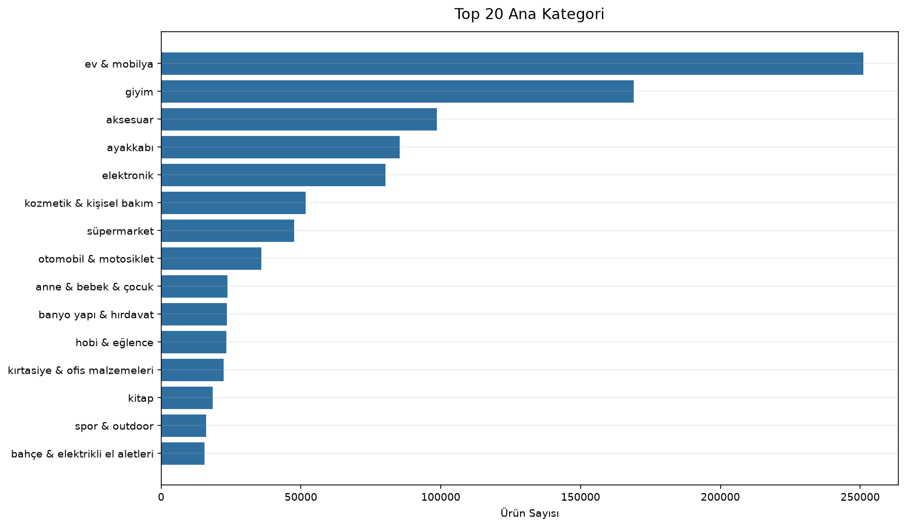
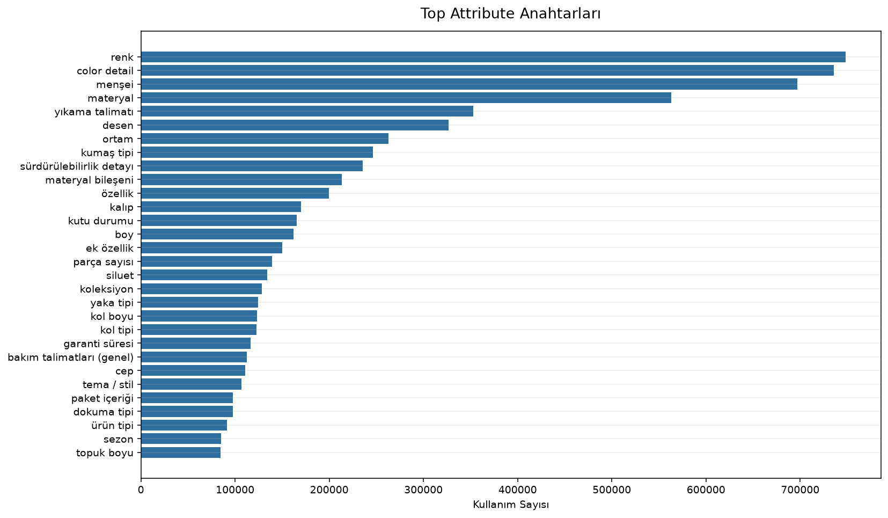

# Sprint 2 EDA ve Veri Anlama Raporu

Bu rapor Sprint 2 kapsamında yalnızca exploratory data analysis amacıyla üretilmiştir. Model eğitimi, feature engineering, embedding, TF-IDF, negative sampling veya submission üretimi yapılmamıştır.

## Query Analizi

### Metrikler
- **total query count:** 50153
- **unique query count:** 50153
- **unique query ratio:** 100.00
- **average character length:** 16.18
- **average word count:** 2.62
- **shortest query:** hp
- **shortest query length:** 2
- **longest query:** bilge ilaç matcha premium japanese diğer bitki çayları
- **longest query length:** 54
- **turkish character query count:** 29802
- **turkish character query ratio:** 59.42
- **numeric query count:** 3135
- **numeric query ratio:** 6.25
- **single word query count:** 4851
- **single word query ratio:** 9.67
- **multi word query count:** 45302
- **multi word query ratio:** 90.33

### Grafikler

### Query Length Histogram
| length_bin | count |
| --- | --- |
| (1.947, 4.6] | 801 |
| (4.6, 7.2] | 3087 |
| (7.2, 9.8] | 3054 |
| (9.8, 12.4] | 9000 |
| (12.4, 15.0] | 9348 |
| (15.0, 17.6] | 5801 |
| (17.6, 20.2] | 7404 |
| (20.2, 22.8] | 3531 |
| (22.8, 25.4] | 3640 |
| (25.4, 28.0] | 2169 |

_İlk 10 satır gösterildi; toplam 20 satır._

### Query Word Count Histogram
| word_count | count |
| --- | --- |
| 1 | 4851 |
| 2 | 20568 |
| 3 | 16496 |
| 4 | 5916 |
| 5 | 1716 |
| 6 | 484 |
| 7 | 94 |
| 8 | 27 |
| 9 | 1 |

### Top Words
| word | count |
| --- | --- |
| erkek | 2144 |
| kadın | 1811 |
| çocuk | 1358 |
| ayakkabı | 1072 |
| bebek | 980 |
| seti | 932 |
| takımı | 902 |
| makinesi | 691 |
| ceket | 645 |
| kız | 601 |

_İlk 10 satır gösterildi; toplam 30 satır._

### Yorum
- Query benzersizlik oranı %100.00; bu değer kullanıcı arama alanının tekrar edip etmediğini gösterir.
- Ortalama kelime sayısı 2.62; query'ler kısa ise lexical eşleşme sinyalleri daha kritik hale gelir.
- Tek kelimelik query oranı %9.67; bu oran yüksekse marka, kategori ve attribute bilgisi ayrıştırıcı olabilir.
- Sayı içeren query oranı %6.25; beden, model, seri ve ölçü benzeri niyetlerin varlığına işaret edebilir.
- Türkçe karakter içeren query oranı %59.42; metin normalizasyonu kararlarında Türkçe karakter davranışı özellikle korunmalıdır.

## Ürün Analizi

### Metrikler
- **total item count:** 962873
- **unique brand count:** 79788
- **brand unknown count:** 4
- **brand unknown ratio:** 0.00
- **brand coverage ratio:** 100.00
- **average title length:** 55.02
- **shortest title:** 530
- **shortest title length:** 3
- **longest title:** yoğun nem veren besleyici el kremi kundal shea butter & macadamia pure hand cream 50ml (baby powder)
- **longest title length:** 100
- **highest unknown column:** gender
- **highest unknown ratio:** 61.35

### Grafikler

### Top 20 Brands
| brand | count | percentage |
| --- | --- | --- |
| adidas | 7982 | 0.83 |
| koton | 7807 | 0.81 |
| defacto | 7756 | 0.81 |
| nike | 6762 | 0.70 |
| u.s. polo assn. | 5443 | 0.57 |
| puma | 5417 | 0.56 |
| pierre cardin | 4557 | 0.47 |
| karaca | 4050 | 0.42 |
| teona ahşap | 3762 | 0.39 |
| lc waikiki | 3597 | 0.37 |

_İlk 10 satır gösterildi; toplam 20 satır._

### Gender Distribution
| gender | count | percentage |
| --- | --- | --- |
| unknown | 590714 | 61.35 |
| kadın | 192045 | 19.94 |
| erkek | 99433 | 10.33 |
| unisex | 80681 | 8.38 |

### Age Group Distribution
| age_group | count | percentage |
| --- | --- | --- |
| unknown | 572028 | 59.41 |
| yetişkin | 280876 | 29.17 |
| çocuk | 52876 | 5.49 |
| genç | 31246 | 3.25 |
| bebek | 18426 | 1.91 |
| bebek & çocuk | 7421 | 0.77 |

### Top 20 Categories
| category | count | percentage |
| --- | --- | --- |
| ayakkabı/spor ayakkabı/sneaker | 24492 | 2.54 |
| elektronik/elektronik aksesuarlar/cep telefonu aksesuarları/kapak & kılıf | 19269 | 2.00 |
| ev & mobilya/ev/ev dekorasyon/tablo | 17606 | 1.83 |
| aksesuar/saat | 14630 | 1.52 |
| giyim/üst giyim/sweatshirt | 12980 | 1.35 |
| giyim/üst giyim/t-shirt | 12281 | 1.28 |
| aksesuar/çanta/omuz çantası | 11297 | 1.17 |
| ev & mobilya/mobilya/halı / kilim/halı | 10722 | 1.11 |
| giyim/alt giyim/pantolon | 10500 | 1.09 |
| ayakkabı/bot & çizme/bot & bootie | 8791 | 0.91 |

_İlk 10 satır gösterildi; toplam 20 satır._

### Unknown Summary
| column | unknown_count | unknown_percentage |
| --- | --- | --- |
| title | 0 | 0 |
| category | 0 | 0 |
| brand | 4 | 0.00 |
| gender | 590714 | 61.35 |
| age_group | 572028 | 59.41 |
| attributes | 19025 | 1.98 |

### Yorum
- Marka doluluk oranı %100.00; marka bilgisinin katalog içinde ne kadar güvenilir sinyal olabileceğini gösterir.
- Ortalama title uzunluğu 55.02 karakter; ürün başlıkları query ile eşleşme niyetini anlamak için temel metin kaynağıdır.
- En yüksek unknown oranı gender kolonunda %61.35; veri temizliği ve modelleme öncesi bu alan ayrıca izlenmelidir.
- Gender, age group ve category dağılımları katalog segmentlerinin dengeli olup olmadığını anlamak için kritik bağlam sağlar.

## Category Analizi

### Metrikler
- **total category rows:** 962873
- **main category count:** 15
- **average category depth:** 3.80
- **deepest category:** ev & mobilya/ev/ev tekstili/yatak odası tekstili/yorgan/tek kişilik yorgan
- **deepest category depth:** 6
- **unique full category count:** 2932
- **category tree parent count:** 495
- **category tree edge count:** 3408

### Grafikler

### Top 20 Main Categories
| main_category | count | percentage |
| --- | --- | --- |
| ev & mobilya | 251121 | 26.08 |
| giyim | 169064 | 17.56 |
| aksesuar | 98686 | 10.25 |
| ayakkabı | 85418 | 8.87 |
| elektronik | 80181 | 8.33 |
| kozmetik & kişisel bakım | 51633 | 5.36 |
| süpermarket | 47551 | 4.94 |
| otomobil & motosiklet | 35915 | 3.73 |
| anne & bebek & çocuk | 23745 | 2.47 |
| banyo yapı & hırdavat | 23595 | 2.45 |

_İlk 10 satır gösterildi; toplam 15 satır._

### Top 20 Subcategories
| subcategory | count | percentage |
| --- | --- | --- |
| ev | 178774 | 3.71 |
| mobilya | 72347 | 1.50 |
| sofra & mutfak | 71775 | 1.49 |
| ev dekorasyon | 54489 | 1.13 |
| üst giyim | 47974 | 1.00 |
| elektronik aksesuarlar | 41884 | 0.87 |
| sofra | 40562 | 0.84 |
| spor ayakkabı | 40141 | 0.83 |
| takı & mücevher | 30784 | 0.64 |
| ev tekstili | 28308 | 0.59 |

_İlk 10 satır gösterildi; toplam 20 satır._

### Category Depth Distribution
| depth | count | percentage |
| --- | --- | --- |
| 2 | 30915 | 3.21 |
| 3 | 362553 | 37.65 |
| 4 | 357069 | 37.08 |
| 5 | 191413 | 19.88 |
| 6 | 20923 | 2.17 |

### Category Tree Summary
| main_category | item_count | unique_leaf_count | average_depth | max_depth |
| --- | --- | --- | --- | --- |
| ev & mobilya | 251121 | 301 | 4.73 | 6 |
| giyim | 169064 | 210 | 3.25 | 5 |
| aksesuar | 98686 | 124 | 3.13 | 5 |
| ayakkabı | 85418 | 39 | 3 | 3 |
| elektronik | 80181 | 290 | 4.22 | 5 |
| kozmetik & kişisel bakım | 51633 | 140 | 3.62 | 5 |
| süpermarket | 47551 | 484 | 4.29 | 6 |
| otomobil & motosiklet | 35915 | 275 | 3.87 | 5 |
| anne & bebek & çocuk | 23745 | 99 | 3.53 | 4 |
| banyo yapı & hırdavat | 23595 | 173 | 3.31 | 6 |

_İlk 10 satır gösterildi; toplam 15 satır._

### Yorum
- Katalogda 15 ana kategori var; bu çeşitlilik model seçiminde kategori bazlı genelleme ihtiyacını gösterir.
- Ortalama kategori derinliği 3.80; derin yapı query niyetini daha ince segmentlere bağlamak için kullanışlı bağlam sağlayabilir.
- En derin kategori 6 seviyeye sahip; hiyerarşideki uç seviyeler ürün ayrıştırmada önemli olabilir.
- Ana kategori ve alt kategori dağılımları negatif örnekleme sırasında benzer ama yanlış ürünleri seçerken dikkat edilmesi gereken alanları işaret eder.

## Attribute Analizi

### Metrikler
- **total item count:** 962873
- **items with attributes:** 943848
- **items without attributes:** 19025
- **attribute fill ratio:** 98.02
- **average attribute count:** 10.56
- **maximum attribute count:** 34
- **minimum attribute count:** 0
- **unique attribute key count:** 1416
- **total parsed attribute key count:** 10172007

### Grafikler

### Top 30 Attribute Keys
| attribute_key | count | percentage |
| --- | --- | --- |
| renk | 748419 | 7.36 |
| color detail | 735769 | 7.23 |
| menşei | 697242 | 6.85 |
| materyal | 563359 | 5.54 |
| yıkama talimatı | 352902 | 3.47 |
| desen | 326945 | 3.21 |
| ortam | 262735 | 2.58 |
| kumaş tipi | 246196 | 2.42 |
| sürdürülebilirlik detayı | 235637 | 2.32 |
| materyal bileşeni | 213565 | 2.10 |

_İlk 10 satır gösterildi; toplam 30 satır._

### Attribute Count Distribution
| attribute_count | item_count | percentage |
| --- | --- | --- |
| 0 | 19025 | 1.98 |
| 1 | 36926 | 3.83 |
| 2 | 45275 | 4.70 |
| 3 | 52019 | 5.40 |
| 4 | 54442 | 5.65 |
| 5 | 62096 | 6.45 |
| 6 | 82935 | 8.61 |
| 7 | 77693 | 8.07 |
| 8 | 56810 | 5.90 |
| 9 | 49923 | 5.18 |

_İlk 10 satır gösterildi; toplam 35 satır._

### Yorum
- Attribute doluluk oranı %98.02; ürün açıklamasının title dışındaki yapılandırılmış sinyal gücünü gösterir.
- Ortalama attribute sayısı 10.56; katalogda ürünlerin ne kadar detaylı tanımlandığını anlamamızı sağlar.
- Toplam 1416 benzersiz attribute anahtarı var; bu çeşitlilik ileride kontrollü feature engineering tasarımı gerektirebilir.
- Renk, materyal, beden, garanti ve uyumlu model gibi attribute anahtarları query niyetiyle doğrudan eşleşebileceği için Sprint 3 kararlarında güçlü aday alanlardır.

## Training Pair Analizi

### Metrikler
- **total pair count:** 250000
- **unique query count:** 17968
- **unique item count:** 229416
- **average items per query:** 13.91
- **maximum items per query:** 1525
- **minimum items per query:** 1
- **average queries per item:** 1.09
- **maximum queries per item:** 7
- **minimum queries per item:** 1
- **positive label count:** 250000
- **negative label count:** 0
- **positive label ratio:** 100.00
- **negative label ratio:** 0.00

### Label Distribution
| label | count | percentage |
| --- | --- | --- |
| 1 | 250000 | 100 |

### Items Per Query Distribution
| item_count | entity_count | percentage |
| --- | --- | --- |
| 1 | 2067 | 11.50 |
| 2 | 1795 | 9.99 |
| 3 | 1421 | 7.91 |
| 4 | 1265 | 7.04 |
| 5 | 1057 | 5.88 |
| 6 | 967 | 5.38 |
| 7 | 886 | 4.93 |
| 8 | 714 | 3.97 |
| 9 | 623 | 3.47 |
| 10 | 593 | 3.30 |

_İlk 10 satır gösterildi; toplam 213 satır._

### Queries Per Item Distribution
| query_count | entity_count | percentage |
| --- | --- | --- |
| 1 | 211618 | 92.24 |
| 2 | 15484 | 6.75 |
| 3 | 1922 | 0.84 |
| 4 | 325 | 0.14 |
| 5 | 56 | 0.02 |
| 6 | 9 | 0.00 |
| 7 | 2 | 0.00 |

### Top 20 Queries
| term_id | matched_item_count |
| --- | --- |
| TERM_ed00a6c9 | 1525 |
| TERM_179587de | 1268 |
| TERM_f9bf4be7 | 1238 |
| TERM_24da8801 | 1144 |
| TERM_ace44d09 | 1005 |
| TERM_be9c6f5f | 699 |
| TERM_492e08cf | 682 |
| TERM_23b20a55 | 623 |
| TERM_1eda316f | 569 |
| TERM_4116f03c | 538 |

_İlk 10 satır gösterildi; toplam 20 satır._

### Top 20 Items
| item_id | matched_query_count |
| --- | --- |
| ITEM_e21b4536c754 | 7 |
| ITEM_8a0f7cf03526 | 7 |
| ITEM_86db627e33bd | 6 |
| ITEM_f33f87eed24b | 6 |
| ITEM_53497cf3eff6 | 6 |
| ITEM_d77296c991f8 | 6 |
| ITEM_8e9277dd26b0 | 6 |
| ITEM_be31e3a0838d | 6 |
| ITEM_1ec8596efbc7 | 6 |
| ITEM_9e8628e391cb | 6 |

_İlk 10 satır gösterildi; toplam 20 satır._

### Yorum
- Training setinde 250000 pair var; bu sayı pozitif eşleşme grafiğinin toplam gözlem hacmini gösterir.
- Query başına ortalama ürün sayısı 13.91; query'lerin katalogda ne kadar geniş ürün alanına bağlandığını anlamamızı sağlar.
- Ürün başına ortalama query sayısı 1.09; popüler ürünlerin birden fazla arama niyetiyle eşleşip eşleşmediğini gösterir.
- Pozitif label oranı %100.00; etiket dağılımı modelleme öncesi değerlendirme stratejisini doğrudan etkiler.

## Train/Test Analizi

### Metrikler
- **train unique query count:** 17968
- **test unique query count:** 32185
- **test query seen in train count:** 0
- **test query seen in train ratio:** 0.00
- **new test query count:** 32185
- **train unique item count:** 229416
- **test unique item count:** 929781
- **test item seen in train count:** 196324
- **test item seen in train ratio:** 21.12
- **new test item count:** 733457
- **train unique pair count:** 250000
- **test unique pair count:** 3359679
- **exact pair overlap count:** 0
- **exact pair overlap ratio:** 0.00

### Query Overlap
| entity | train_unique_count | test_unique_count | test_seen_in_train_count | test_seen_in_train_percentage | test_new_count | test_new_percentage | train_only_count |
| --- | --- | --- | --- | --- | --- | --- | --- |
| query | 17968 | 32185 | 0 | 0 | 32185 | 100 | 17968 |

### Item Overlap
| entity | train_unique_count | test_unique_count | test_seen_in_train_count | test_seen_in_train_percentage | test_new_count | test_new_percentage | train_only_count |
| --- | --- | --- | --- | --- | --- | --- | --- |
| item | 229416 | 929781 | 196324 | 21.12 | 733457 | 78.88 | 33092 |

### Yorum
- Test query'lerinin %0.00 kadarı train'de görülmüş; bu oran query cold-start riskini gösterir.
- Test item'larının %21.12 kadarı train'de görülmüş; ürün cold-start durumu model seçimini etkileyebilir.
- Tam pair overlap oranı %0.00; train'deki aynı query-item eşleşmelerinin test adaylarında ne kadar tekrarlandığını gösterir.
- Train/test overlap bilgisi ileride ezberleme riski, cold-start dayanıklılığı ve aday sıralama stratejisi için temel karar girdisidir.

## Veri Kalitesi

### Metrikler
- **dataset count:** 5
- **total row count:** 7982384
- **total duplicate rows:** 0
- **total missing values:** 2
- **total empty strings:** 2
- **total unknown values:** 1181771
- **total unexpected character rows:** 53082
- **total encoding problem rows:** 12

### Dataset Quality Summary
| dataset | row_count | column_count | duplicate_rows | duplicate_percentage |
| --- | --- | --- | --- | --- |
| terms | 50153 | 2 | 0 | 0 |
| items | 962873 | 7 | 0 | 0 |
| training_pairs | 250000 | 4 | 0 | 0 |
| submission_pairs | 3359679 | 3 | 0 | 0 |
| sample_submission | 3359679 | 2 | 0 | 0 |

### Column Quality Summary
| dataset | column | dtype | missing_count | missing_percentage | empty_string_count | empty_string_percentage | unknown_count | unknown_percentage | long_text_count | long_text_threshold | unexpected_character_count | unexpected_character_percentage | encoding_problem_count | encoding_problem_percentage |
| --- | --- | --- | --- | --- | --- | --- | --- | --- | --- | --- | --- | --- | --- | --- |
| terms | term_id | str | 0 | 0 | 0 | 0 | 0 | 0 | 0 | 120 | 0 | 0 | 0 | 0 |
| terms | query | str | 0 | 0 | 0 | 0 | 0 | 0 | 0 | 120 | 13 | 0.03 | 0 | 0 |
| items | item_id | str | 0 | 0 | 0 | 0 | 0 | 0 | 0 | 120 | 0 | 0 | 0 | 0 |
| items | title | str | 0 | 0 | 0 | 0 | 0 | 0 | 0 | 120 | 35873 | 3.73 | 9 | 0.00 |
| items | category | str | 0 | 0 | 0 | 0 | 0 | 0 | 24 | 120 | 0 | 0 | 0 | 0 |
| items | brand | str | 2 | 0.00 | 2 | 0.00 | 4 | 0.00 | 0 | 120 | 644 | 0.07 | 0 | 0 |
| items | gender | str | 0 | 0 | 0 | 0 | 590714 | 61.35 | 0 | 120 | 0 | 0 | 0 | 0 |
| items | age_group | str | 0 | 0 | 0 | 0 | 572028 | 59.41 | 0 | 120 | 0 | 0 | 0 | 0 |
| items | attributes | str | 0 | 0 | 0 | 0 | 19025 | 1.98 | 9580 | 692 | 16552 | 1.72 | 3 | 0.00 |
| training_pairs | id | str | 0 | 0 | 0 | 0 | 0 | 0 | 0 | 120 | 0 | 0 | 0 | 0 |

_İlk 10 satır gösterildi; toplam 18 satır._

### Yorum
- Tüm datasetlerde toplam 0 duplicate row tespit edildi; duplicate oranları veri ayrımı ve değerlendirme öncesinde takip edilmelidir.
- En yüksek missing oranı items.brand kolonunda %0.00.
- En yüksek unknown/boş değer riski items.gender kolonunda %61.35.
- Olası encoding problemi sayısı 12; bu değer yüksekse metin temizliği öncesi örnek kayıtlar manuel incelenmelidir.

## Öğrendiğimiz En Önemli İçgörüler

- Train query ve test query kümeleri ayrık görünüyor; test query overlap oranı %0.00.
- Training pairs yalnızca pozitif label içeriyor; pozitif oran %100.00.
- Attribute alanı güçlü bir katalog sinyali sunuyor; doluluk oranı %98.02.
- Ürün metadata tarafındaki en büyük kalite riski gender ve age_group alanlarında; en yüksek unknown oranı %61.35.
- Query seti tamamen benzersiz görünüyor; benzersizlik oranı %100.00.
- Genel duplicate riski düşük; tüm datasetlerde duplicate row sayısı 0.

## Sprint 3 İçin Öneriler

- Feature Engineering çalışmalarında query text, title, category ve attributes önceliklendirilmeli.
- Train/test query overlap olmadığı için id ezberine dayalı yaklaşımlardan kaçınılmalı.
- Negative sampling stratejisi kategori ve title benzerliğini dikkate alarak zor negatifleri kontrollü üretmeli.
- Gender ve age_group yüksek unknown oranları nedeniyle doğrudan kullanılmadan önce kalite etkisi ölçülmeli.
- Attribute anahtarları çok çeşitli olduğu için Sprint 3'te en sık ve en anlamlı anahtarlar seçilerek ilerlenmeli.

## Sprint Sonu Soruları

1. Yarışmadaki en büyük veri avantajımız, title/category/attributes gibi zengin ürün içerik alanlarının bulunması ve attribute doluluk oranının %98.02 olmasıdır.
2. En büyük veri problemi, train tarafının pozitif-only görünmesi ve test query'lerinin train'de hiç görülmemesidir.
3. Negative Sampling yaparken aynı kategori içindeki benzer ürünlere, popüler ürün bias'ına, train/test ayrımına ve false negative riskine dikkat etmeliyiz.
4. Feature Engineering için en değerli kolonlar query, title, category, brand ve attributes alanlarıdır.
5. Sprint 3'e geçmeye hazırız; özellikle cold-start query yapısı ve %21.12 item overlap oranı artık net şekilde biliniyor.
