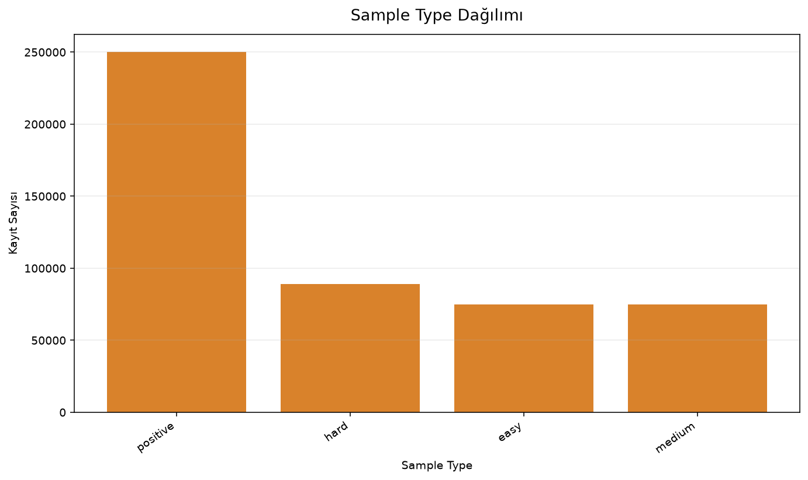
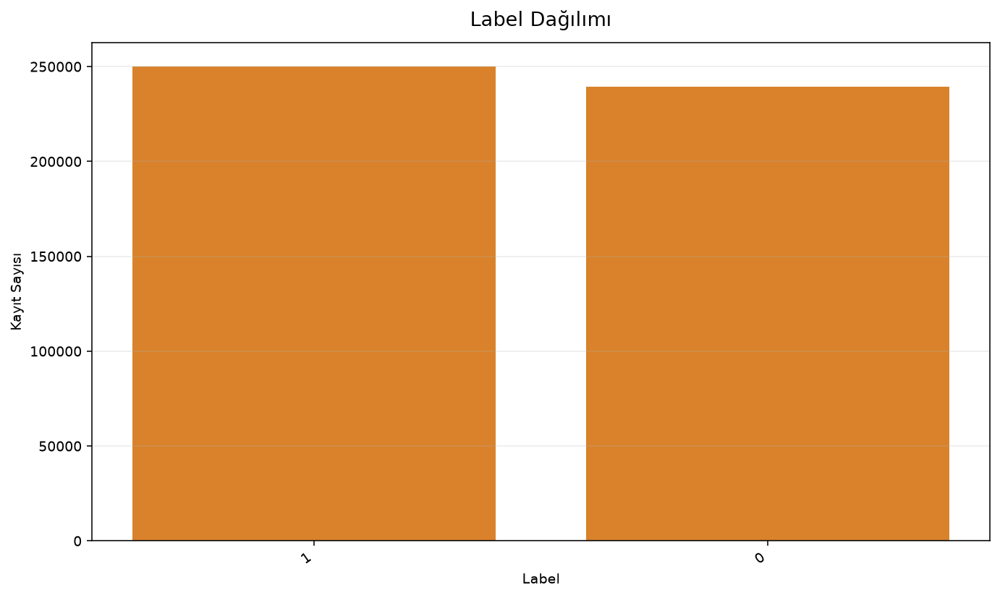
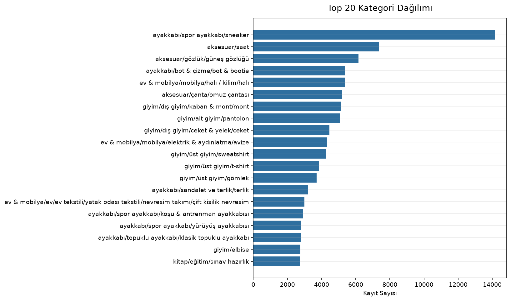

# Sprint 3 Negative Sampling Raporu

Bu rapor yalnızca negative sampling pipeline çıktısını açıklar. Model eğitimi, TF-IDF, embedding, Sentence Transformer, LightGBM, CatBoost, XGBoost veya submission üretimi yapılmamıştır.

## Sampling Stratejisi

Sampling oranları config üzerinden yönetilir:

- `easy`: %30.00
- `medium`: %30.00
- `hard`: %40.00

Üretilen pozitif ve negatif örneklerde final kolon seti `query`, `item_id`, `title`, `category`, `brand`, `attributes`, `label`, `sample_type` şeklindedir.

### Sampling Sonuçları
| sample_type | requested_count | generated_before_validation | elapsed_seconds |
| --- | --- | --- | --- |
| easy | 75000 | 75000 | 0.61 |
| medium | 75000 | 75000 | 0.60 |
| hard | 100000 | 100000 | 40.44 |

## Easy Sampling

Easy negative örnekler, pozitif ürünün ana kategorisinden farklı ana kategoriden seçilir. Bu grup false-negative riski düşük ama model için ayrıştırıcı temel kontrast sağlar.

## Medium Sampling

Medium negative örnekler, aynı ana kategori içinde ancak farklı ilk alt kategoriden seçilir. Bu grup kategori bağlamını koruyarak daha gerçekçi negatifler üretir.

## Hard Sampling

Hard negative örnekler, aynı full kategori içinde query-title lexical overlap skoru yüksek ürünlerden seçilir. TF-IDF veya embedding kullanılmaz; yalnızca token Jaccard benzerliği sampling amacıyla hesaplanır.

## False Negative Analizi

| input_count | output_count | known_positive_pair_count | same_item_count | exact_query_title_match_count | high_risk_similarity_count | dropped_high_risk_count |
| --- | --- | --- | --- | --- | --- | --- |
| 250000 | 239204 | 9775 | 0 | 1471 | 1540 | 1540 |

Validator bilinen pozitif pair'leri, aynı item seçimlerini, query-title birebir eşleşmelerini ve yüksek lexical similarity risklerini kontrol eder.

## Veri Dağılımı

| sample_type | count | percentage |
| --- | --- | --- |
| positive | 250000 | 51.10 |
| hard | 89208 | 18.24 |
| easy | 74999 | 15.33 |
| medium | 74997 | 15.33 |

| label | count | percentage |
| --- | --- | --- |
| 1 | 250000 | 51.10 |
| 0 | 239204 | 48.90 |

| category | count | percentage |
| --- | --- | --- |
| ayakkabı/spor ayakkabı/sneaker | 14138 | 2.89 |
| aksesuar/saat | 7373 | 1.51 |
| aksesuar/gözlük/güneş gözlüğü | 6171 | 1.26 |
| ayakkabı/bot & çizme/bot & bootie | 5374 | 1.10 |
| ev & mobilya/mobilya/halı / kilim/halı | 5361 | 1.10 |
| aksesuar/çanta/omuz çantası | 5192 | 1.06 |
| giyim/dış giyim/kaban & mont/mont | 5157 | 1.05 |
| giyim/alt giyim/pantolon | 5076 | 1.04 |
| giyim/dış giyim/ceket & yelek/ceket | 4460 | 0.91 |
| ev & mobilya/mobilya/elektrik & aydınlatma/avize | 4339 | 0.89 |
| giyim/üst giyim/sweatshirt | 4263 | 0.87 |
| giyim/üst giyim/t-shirt | 3857 | 0.79 |

_İlk 12 satır gösterildi; toplam 20 satır._

## Pipeline Performansı

- Toplam süre: 45.00 saniye
- Bellek kullanımı: 590.21 MB
- Pozitif örnek sayısı: 250000
- Negatif örnek sayısı: 239204
- Toplam örnek sayısı: 489204

## Sprint 4 İçin Hazırlık

- Sprint 4'te modelleme öncesi bu negatiflerin dağılımı tekrar kontrol edilmeli.
- Hard negative kayıtlarında false-negative riski izlenmeye devam edilmeli.
- Feature Engineering aşamasında `query`, `title`, `category`, `brand` ve `attributes` alanları öncelikli değerlendirilmeli.
- Eğitim/validasyon ayrımı yapılırken aynı query veya aynı ürün sızıntısı riski ayrıca incelenmeli.
