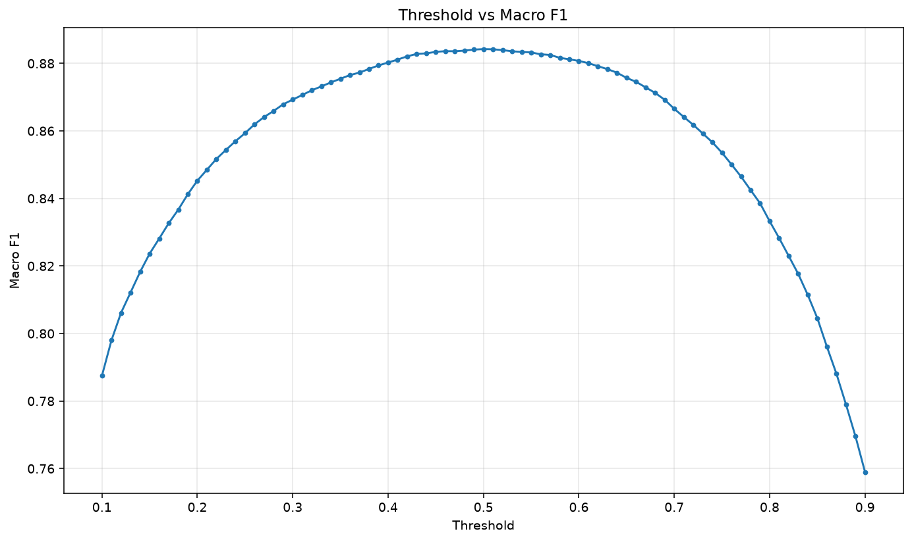

# Threshold Optimization Report

## Scope

This report optimizes only the decision threshold of the existing LightGBM baseline on the validation set. No model retraining, new features, TF-IDF, BM25, embeddings, or parameter changes were performed.

## Best Threshold

- Best threshold: 0.50
- Best Macro F1: 0.884241

## Default Threshold Comparison

| threshold | accuracy | precision | recall | f1 | macro_f1 |
| --- | --- | --- | --- | --- | --- |
| 0.50 | 0.884363 | 0.879141 | 0.897040 | 0.888000 | 0.884241 |
| 0.50 | 0.884363 | 0.879141 | 0.897040 | 0.888000 | 0.884241 |

## Threshold vs Macro F1

## Threshold Scan Results

| threshold | accuracy | precision | recall | f1 | macro_f1 |
| --- | --- | --- | --- | --- | --- |
| 0.100000 | 0.796844 | 0.720394 | 0.984620 | 0.832033 | 0.787518 |
| 0.110000 | 0.805950 | 0.730656 | 0.982440 | 0.838045 | 0.798019 |
| 0.120000 | 0.813074 | 0.738914 | 0.980760 | 0.842831 | 0.806125 |
| 0.130000 | 0.818379 | 0.745551 | 0.978580 | 0.846318 | 0.812171 |
| 0.140000 | 0.823796 | 0.752295 | 0.976840 | 0.849988 | 0.818255 |
| 0.150000 | 0.828651 | 0.758481 | 0.975240 | 0.853310 | 0.823667 |
| 0.160000 | 0.832657 | 0.763803 | 0.973620 | 0.856043 | 0.828121 |
| 0.170000 | 0.836766 | 0.769417 | 0.971820 | 0.858855 | 0.832667 |
| 0.180000 | 0.840404 | 0.774610 | 0.969920 | 0.861332 | 0.836685 |
| 0.190000 | 0.844595 | 0.780374 | 0.968460 | 0.864303 | 0.841246 |
| 0.200000 | 0.848295 | 0.785825 | 0.966580 | 0.866880 | 0.845279 |
| 0.210000 | 0.851228 | 0.790534 | 0.964420 | 0.868863 | 0.848488 |
| 0.220000 | 0.854192 | 0.795449 | 0.962080 | 0.870866 | 0.851720 |
| 0.230000 | 0.856645 | 0.799683 | 0.959940 | 0.872514 | 0.854389 |
| 0.240000 | 0.859037 | 0.803850 | 0.957900 | 0.874140 | 0.856977 |
| 0.250000 | 0.861214 | 0.807958 | 0.955540 | 0.875574 | 0.859340 |
| 0.260000 | 0.863667 | 0.812322 | 0.953520 | 0.877276 | 0.861969 |
| 0.270000 | 0.865660 | 0.816339 | 0.951100 | 0.878582 | 0.864121 |
| 0.280000 | 0.867336 | 0.819833 | 0.948940 | 0.879674 | 0.865926 |
| 0.290000 | 0.869186 | 0.823470 | 0.947040 | 0.880943 | 0.867897 |
| 0.300000 | 0.870463 | 0.826539 | 0.944800 | 0.881722 | 0.869279 |
| 0.310000 | 0.871741 | 0.829483 | 0.942840 | 0.882536 | 0.870648 |
| 0.320000 | 0.873049 | 0.832493 | 0.940900 | 0.883383 | 0.872044 |
| 0.330000 | 0.874122 | 0.835171 | 0.939000 | 0.884048 | 0.873193 |
| 0.340000 | 0.875226 | 0.837839 | 0.937240 | 0.884756 | 0.874367 |
| 0.350000 | 0.876248 | 0.840633 | 0.935120 | 0.885363 | 0.875461 |
| 0.360000 | 0.877260 | 0.843418 | 0.933040 | 0.885968 | 0.876540 |
| 0.370000 | 0.877945 | 0.845969 | 0.930600 | 0.886269 | 0.877287 |
| 0.380000 | 0.878967 | 0.848768 | 0.928620 | 0.886900 | 0.878368 |
| 0.390000 | 0.879948 | 0.851548 | 0.926620 | 0.887499 | 0.879405 |
| 0.400000 | 0.880756 | 0.854233 | 0.924400 | 0.887933 | 0.880264 |
| 0.410000 | 0.881583 | 0.857047 | 0.922080 | 0.888375 | 0.881143 |
| 0.420000 | 0.882483 | 0.860061 | 0.919680 | 0.888872 | 0.882093 |
| 0.430000 | 0.883168 | 0.862852 | 0.917160 | 0.889178 | 0.882823 |
| 0.440000 | 0.883280 | 0.865175 | 0.914040 | 0.888936 | 0.882976 |
| 0.450000 | 0.883689 | 0.867725 | 0.911320 | 0.888989 | 0.883423 |
| 0.460000 | 0.883863 | 0.870008 | 0.908480 | 0.888828 | 0.883630 |
| 0.470000 | 0.883811 | 0.872220 | 0.905260 | 0.888433 | 0.883612 |
| 0.480000 | 0.883955 | 0.874607 | 0.902280 | 0.888228 | 0.883785 |
| 0.490000 | 0.884241 | 0.876910 | 0.899780 | 0.888198 | 0.884096 |
| 0.500000 | 0.884363 | 0.879141 | 0.897040 | 0.888000 | 0.884241 |
| 0.510000 | 0.884292 | 0.881141 | 0.894200 | 0.887623 | 0.884190 |
| 0.520000 | 0.884026 | 0.883196 | 0.890880 | 0.887021 | 0.883945 |
| 0.530000 | 0.883658 | 0.885007 | 0.887680 | 0.886342 | 0.883593 |
| 0.540000 | 0.883454 | 0.887015 | 0.884620 | 0.885816 | 0.883404 |
| 0.550000 | 0.883290 | 0.889400 | 0.881200 | 0.885281 | 0.883255 |
| 0.560000 | 0.882728 | 0.891397 | 0.877420 | 0.884353 | 0.882705 |
| 0.570000 | 0.882524 | 0.893770 | 0.874000 | 0.883775 | 0.882510 |
| 0.580000 | 0.881665 | 0.895565 | 0.869880 | 0.882536 | 0.881659 |
| 0.590000 | 0.881226 | 0.898081 | 0.865840 | 0.881666 | 0.881224 |
| 0.600000 | 0.880735 | 0.900407 | 0.861960 | 0.880764 | 0.880735 |
| 0.610000 | 0.880081 | 0.903057 | 0.857380 | 0.879626 | 0.880079 |
| 0.620000 | 0.879182 | 0.905254 | 0.852840 | 0.878266 | 0.879175 |
| 0.630000 | 0.878323 | 0.908175 | 0.847600 | 0.876843 | 0.878305 |
| 0.640000 | 0.877280 | 0.910442 | 0.842760 | 0.875295 | 0.877249 |
| 0.650000 | 0.875768 | 0.912677 | 0.836980 | 0.873191 | 0.875717 |
| 0.660000 | 0.874623 | 0.915150 | 0.831780 | 0.871476 | 0.874548 |
| 0.670000 | 0.873008 | 0.917361 | 0.825900 | 0.869231 | 0.872902 |
| 0.680000 | 0.871414 | 0.919957 | 0.819700 | 0.866940 | 0.871268 |
| 0.690000 | 0.869421 | 0.922501 | 0.812760 | 0.864160 | 0.869225 |
| 0.700000 | 0.866825 | 0.925158 | 0.804480 | 0.860609 | 0.866559 |
| 0.710000 | 0.864474 | 0.927886 | 0.796720 | 0.857315 | 0.864132 |
| 0.720000 | 0.862215 | 0.930659 | 0.789180 | 0.854100 | 0.861788 |
| 0.730000 | 0.859742 | 0.933013 | 0.781660 | 0.850657 | 0.859221 |
| 0.740000 | 0.857248 | 0.935423 | 0.774100 | 0.847150 | 0.856622 |
| 0.750000 | 0.854325 | 0.938431 | 0.765140 | 0.842972 | 0.853559 |
| 0.760000 | 0.851003 | 0.941077 | 0.755760 | 0.838299 | 0.850078 |
| 0.770000 | 0.847579 | 0.943320 | 0.746600 | 0.833510 | 0.846483 |
| 0.780000 | 0.843818 | 0.946133 | 0.736300 | 0.828132 | 0.842506 |
| 0.790000 | 0.840108 | 0.948934 | 0.726200 | 0.822759 | 0.838561 |
| 0.800000 | 0.835120 | 0.951429 | 0.713800 | 0.815660 | 0.833262 |
| 0.810000 | 0.830439 | 0.954088 | 0.701980 | 0.808845 | 0.828247 |
| 0.820000 | 0.825533 | 0.956676 | 0.689840 | 0.801636 | 0.822964 |
| 0.830000 | 0.820627 | 0.959371 | 0.677700 | 0.794304 | 0.817641 |
| 0.840000 | 0.814924 | 0.962123 | 0.663980 | 0.785719 | 0.811421 |
| 0.850000 | 0.808669 | 0.964785 | 0.649300 | 0.776210 | 0.804558 |
| 0.860000 | 0.801014 | 0.966792 | 0.632340 | 0.764591 | 0.796134 |
| 0.870000 | 0.793829 | 0.969348 | 0.616040 | 0.753326 | 0.788116 |
| 0.880000 | 0.785775 | 0.972195 | 0.597900 | 0.740433 | 0.779032 |
| 0.890000 | 0.777455 | 0.974961 | 0.579400 | 0.726848 | 0.769545 |
| 0.900000 | 0.768328 | 0.978234 | 0.559100 | 0.711531 | 0.758985 |
